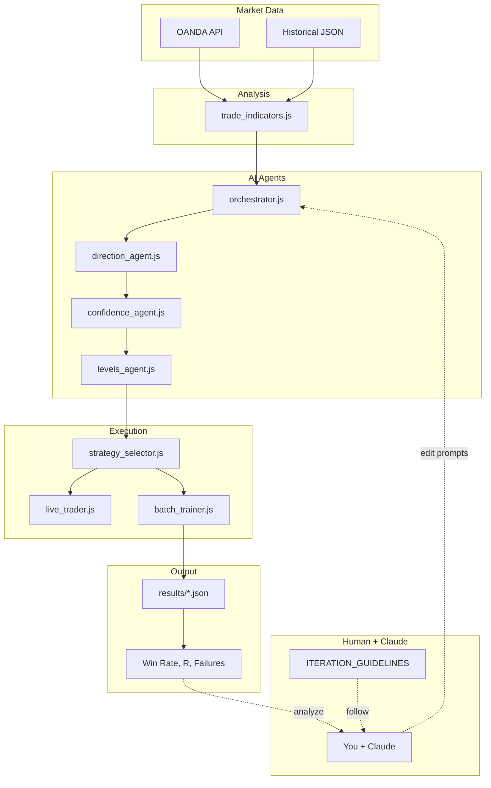
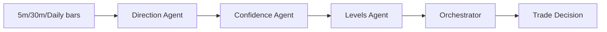
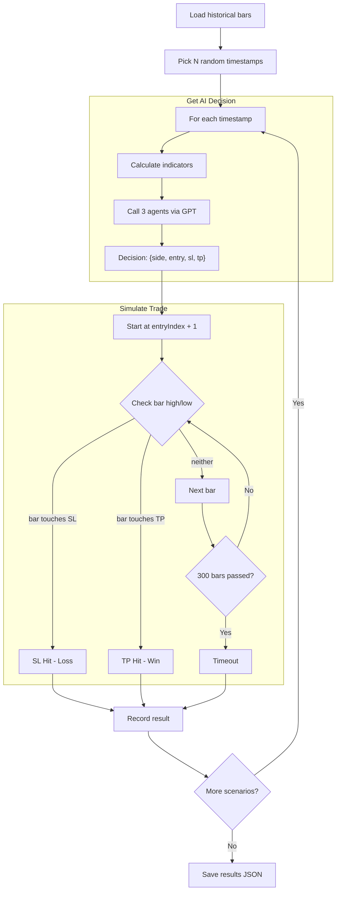
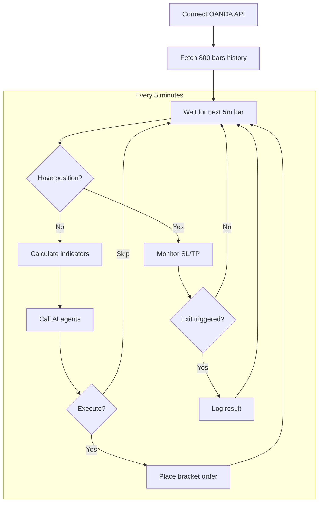

# TRADEBOT

## Purpose
AI-powered EUR/USD trading system using GPT models. Core innovation: **iterate on prompts** as a form of machine learning to improve trading performance.

## Tech Stack
`Node.js` | `GPT-4/GPT-5` | `OANDA API` | `Claude (human-guided iteration)`

## Current Best Model
**GPT-5 Iter5** | 78% Win Rate | +42.62R | 59 trades | Feb 21, 2026

---

## Architecture



**Note:** The iteration loop is NOT automated. You run tests, analyze results with Claude, and manually edit prompts following [ITERATION_GUIDELINES](guidelines/ITERATION_GUIDELINES.md).

---

## Agent Decision Flow



**I/O Formats:**

| Agent | Input | Output |
|-------|-------|--------|
| Direction | `{bars, indicators}` | `{direction: LONG/SHORT/NEUTRAL, reasoning}` |
| Confidence | `{direction, indicators}` | `{probability: 0-1, sizing: FULL/REDUCED/MINIMAL}` |
| Levels | `{direction, confidence, price}` | `{entry, sl, tp, riskR}` |
| Orchestrator | all above | `{side, entry, sl, tp, riskFactor}` or `SKIP` |

---

## Simulation Flow (batch_trainer.js)



**Known Issues (see [SIMULATOR_BUG_ANALYSIS](SIMULATOR_BUG_ANALYSIS.md)):**
- Entry is IMMEDIATE at next bar (no limit fill check)
- Spread calculated but NOT applied to exits
- Same-bar TP+SL conflict always counts as SL

**I/O:**
- Input: `data/eurusd_5m_*.json` (OHLC bars)
- Output: `results/trade_results.json` (decisions + outcomes)

---

## Live Trading Flow (live_trader.js)



**I/O:**
- Input: OANDA real-time 5m bars
- Output: `results/live_trade_results.json`

---

## Folder Structure

```
TRADEBOT/
├── src/                      # Core source code
│   ├── agents/               # AI agent prompts (THE MODEL)
│   │   ├── direction_agent.js
│   │   ├── confidence_agent.js
│   │   ├── levels_agent.js
│   │   ├── orchestrator.js
│   │   └── ai_client.js
│   ├── batch_trainer.js      # Backtest engine (OANDA/IBKR data)
│   ├── live_trader.js        # Live/paper trading
│   ├── iteration_loop.js     # Auto-iteration (experimental, prefer manual)
│   ├── strategy_selector.js  # Decision validation
│   └── trade_indicators.js   # Technical analysis
│
├── data/                     # Historical price data
│   ├── eurusd_5m_oanda.json        # Default OANDA data (symlink to recent)
│   ├── eurusd_5m_oanda_recent.json # OANDA Nov 2025 - Feb 2026
│   ├── eurusd_5m_oanda_old.json    # OANDA Aug 2025 - Nov 2025
│   ├── eurusd_5m_recent.json       # Legacy IBKR (Nov 2025 - Feb 2026)
│   └── eurusd_5m_old.json          # Legacy IBKR (Aug 2025 - Nov 2025)
│
├── models/                   # Saved model versions
│   └── {name}_{YYYYMMDD}/    # e.g., gpt5_iter5_20260221/
│
├── results/                  # Test results
├── tools/                    # Utility scripts
├── archive/                  # Old iterations, backups
└── docs/                     # Documentation
```

---

## Features

| Feature | Description | Docs |
|---------|-------------|------|
| AI Agents | GPT-powered trading decisions | [agents.md](features/agents.md) |
| Batch Trainer | Backtest on historical data | [batch-trainer.md](features/batch-trainer.md) |
| Live Trader | Paper/live trading with OANDA | [live-trader.md](features/live-trader.md) |
| Model System | Versioned prompt checkpoints | [model-system.md](features/model-system.md) |

---

## Guidelines

| Guideline | Purpose |
|-----------|---------|
| [DOC_GUIDELINES.md](guidelines/DOC_GUIDELINES.md) | How to organize documentation |
| [ITERATION_GUIDELINES.md](guidelines/ITERATION_GUIDELINES.md) | How to improve models (human + Claude) |

---

## Models

| Model | Win Rate | Total R | Trades | Date | Docs |
|-------|----------|---------|--------|------|------|
| GPT-4 Baseline | 53.4% | +10.23R | 60 | Feb 21 | [README](../models/gpt4_baseline_20260221/README.md) |
| GPT-5 Iter4 | 74.1% | +38.90R | 58 | Feb 21 | [README](../models/gpt5_iter4_20260221/README.md) |
| **GPT-5 Iter5** | **78.0%** | **+42.62R** | **59** | Feb 21 | [README](../models/gpt5_iter5_20260221/README.md) |

---

## Quick Commands

```bash
# Download OANDA historical data (run once)
node tools/download_oanda_data.js --months 6

# Run backtest
node src/batch_trainer.js

# Run backtest with specific data file
DATA_PATH=data/eurusd_5m_old.json node src/batch_trainer.js

# Analyze results
node tools/analyze_trades.js

# Live paper trading
node src/live_trader.js

# Load saved model
cp models/gpt5_iter5_20260221/*.js src/agents/
```

---

## Documentation

| Document | Purpose |
|----------|---------|
| [DIARY.md](DIARY.md) | Development history (chronological) |
| [MISTAKES.md](MISTAKES.md) | Solved challenges & lessons learned |
| [CONVENTIONS.md](CONVENTIONS.md) | Naming standards |

---

## Reports & Analysis

| Report | Description |
|--------|-------------|
| [SIMULATOR_BUG_ANALYSIS.md](SIMULATOR_BUG_ANALYSIS.md) | Critical bugs in backtester |
| [LIVE_SESSION_ANALYSIS_20260218.md](LIVE_SESSION_ANALYSIS_20260218.md) | Feb 18 live trading session |
| [BENCHMARK_OLD_TRADES.md](BENCHMARK_OLD_TRADES.md) | Old data performance |

---

## Next Steps

- [ ] Fix simulator bugs (see [SIMULATOR_BUG_ANALYSIS](SIMULATOR_BUG_ANALYSIS.md))
- [ ] Fix risk-win correlation in confidence agent
- [ ] Reduce long bias (currently 67-69% longs)
- [ ] Add high-confidence trades (most capped at 0.4-0.55)

---

## Quick Navigation

**Start Here:**
1. Read this file (STRUCTURE.md)
2. Check [DIARY.md](DIARY.md) for recent work
3. Follow [ITERATION_GUIDELINES.md](guidelines/ITERATION_GUIDELINES.md) to improve

**Understand the System:**
- [features/agents.md](features/agents.md) - How decisions are made
- [features/batch-trainer.md](features/batch-trainer.md) - How simulation works

**Add Documentation:**
- [DOC_GUIDELINES.md](guidelines/DOC_GUIDELINES.md) - Rules for docs
