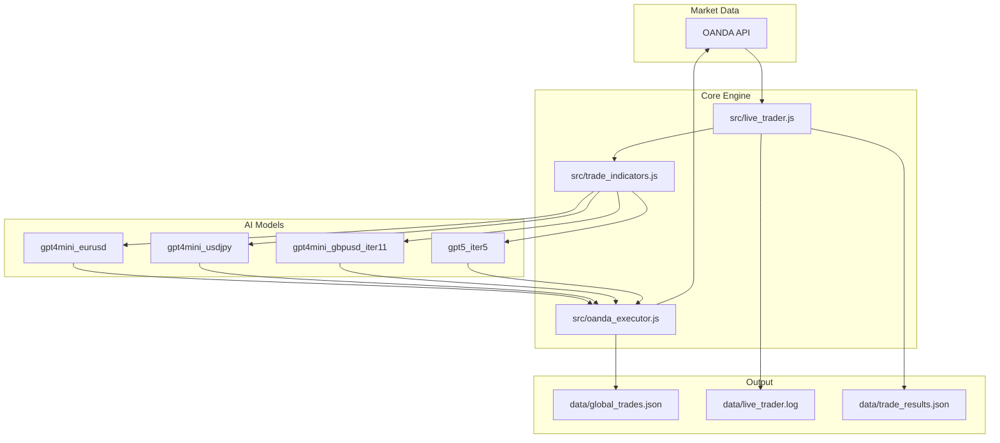
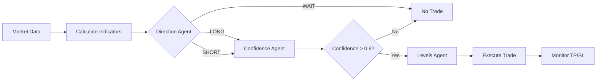
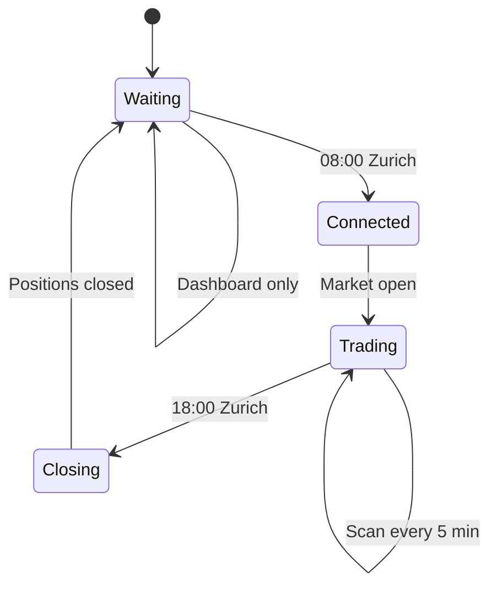

# TRADEBOT Live

AI-powered forex trading system for live paper trading across 4 currency pairs via OANDA.

`Node.js` | `GPT-4o-mini` | `GPT-5.2` | `OANDA API`

**Current best model:** GPT-5.2 Iter5 -- 78% win rate across 59 trades.

---

## Architecture



---

## Agent Decision Flow



| Agent | Input | Output |
|-------|-------|--------|
| Direction Agent | Candles, indicators, S/R levels | LONG / SHORT / WAIT |
| Confidence Agent | Direction, indicators, market context | Confidence score 0.0-1.0 |
| Levels Agent | Direction, ATR, swing points | Entry, TP, SL prices |

---

## Live Trading Flow



---

## Folder Structure

```
TRADEBOT_live/
├── src/                              # Core runtime
│   ├── live_trader.js                # Main loop, dashboard, session mgmt
│   ├── oanda_executor.js             # OANDA API wrapper
│   ├── trade_indicators.js           # ATR, EMA, S/R, swing points
│   ├── pair_config.js                # Pair definitions
│   ├── strategy_selector_eurusd.js   # -> models/gpt4mini_eurusd/
│   ├── strategy_selector_usdjpy.js   # -> models/gpt4mini_usdjpy/
│   ├── strategy_selector_gbpusd.js   # -> models/gpt4mini_gbpusd_iter11/
│   └── strategy_selector_gpt5.js     # -> models/gpt5_iter5/
│
├── models/                           # Versioned AI agent checkpoints
│   ├── gpt4mini_eurusd/
│   ├── gpt4mini_usdjpy/
│   ├── gpt4mini_gbpusd_iter11/
│   └── gpt5_iter5/
│
├── tools/                            # Utilities & test scripts
│   ├── test_1k_order.js
│   ├── test_oanda_limit.js
│   ├── test_position_sizes.js
│   ├── check_oanda.js
│   ├── cancel_orders.js
│   ├── analyze_pnl.js
│   └── oanda_test.js
│
├── data/                             # Trade data & logs
│   ├── global_trades.json
│   ├── trade_results.json
│   └── live_trader.log
│
├── docs/
│   ├── STRUCTURE.md                 # <-- YOU ARE HERE
│   ├── DIARY.md
│   ├── MISTAKES.md
│   ├── CONVENTIONS.md
│   ├── features/
│   ├── guidelines/
│   └── reports/
│
├── CONTEXT.md
├── .env
├── .gitignore
└── package.json
```

---

## Features

| Feature | Description | Docs |
|---------|-------------|------|
| Live Trading Loop | 24/7 runner with market hour detection | [live-trader.md](features/live-trader.md) |
| AI Agents | GPT-powered multi-agent decision system | [ai-agents.md](features/ai-agents.md) |
| OANDA Executor | Trade execution & position management | [oanda-executor.md](features/oanda-executor.md) |
| Model System | Versioned AI checkpoints with metadata | [model-system.md](features/model-system.md) |

---

## Models

| Model | Pair | LLM | Notes |
|-------|------|-----|-------|
| gpt4mini_eurusd | EUR/USD | GPT-4o-mini | Baseline |
| gpt4mini_usdjpy | USD/JPY | GPT-4o-mini | Structure-aware |
| gpt4mini_gbpusd_iter11 | GBP/USD | GPT-4o-mini | Risk-adjusted, bad pattern detection |
| gpt5_iter5 | EUR/USD | GPT-5.2 | Best performer (78% WR) |

---

## Guidelines

| Guide | Description |
|-------|-------------|
| [DOC_GUIDELINES.md](guidelines/DOC_GUIDELINES.md) | How to maintain docs |
| [CLOUDFLARE_TUNNEL_GUIDE.md](guidelines/CLOUDFLARE_TUNNEL_GUIDE.md) | Remote access setup |

---

## Reports

| Report | Description |
|--------|-------------|
| [benchmark_old_trades.md](reports/benchmark_old_trades.md) | Historical trade analysis |
| [live_session_20260218.md](reports/live_session_20260218.md) | First live session |
| [trade_review_20260227.md](reports/trade_review_20260227.md) | Feb 27 trade review |

---

## Documentation

| Doc | Description |
|-----|-------------|
| [DIARY.md](DIARY.md) | Chronological dev log |
| [MISTAKES.md](MISTAKES.md) | Solved challenges |
| [CONVENTIONS.md](CONVENTIONS.md) | Naming standards |

---

## Quick Commands

```bash
npm start                          # Start trading bot
node src/live_trader.js            # Direct start
node tools/check_oanda.js          # Check account status
node tools/analyze_pnl.js          # Analyze trade history
node tools/analyze_pnl.js log      # Analyze from log file
node tools/cancel_orders.js        # Cancel pending orders
```

---

## Next Steps

- [ ] Implement dynamic position sizing
- [ ] Add Telegram notifications
- [ ] Multi-timeframe analysis
