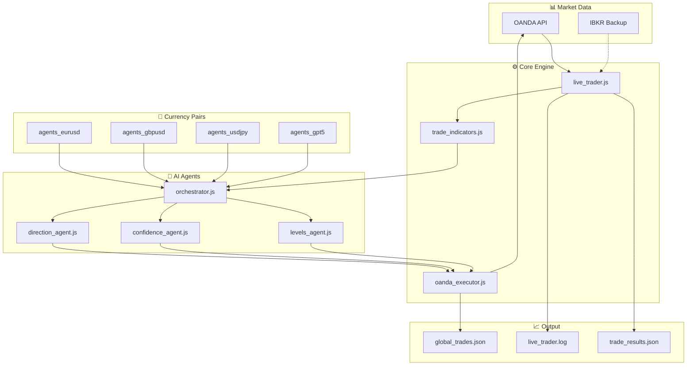
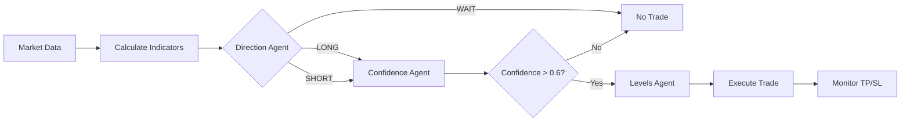

# TRADEBOT Live

## Purpose
AI-powered forex trading system using GPT-4o-mini for live paper trading with OANDA. Runs 24/7, trades during Zurich market hours (8:00-18:00).

## Tech Stack
`Node.js` | `GPT-4o-mini` | `OANDA API` | `IBKR` (backup)

---

## Architecture



---

## Decision Flow



---

## Folder Structure

```
TRADEBOT_live/
├── live_trader.js          # Main 24/7 loop
├── oanda_executor.js       # Trade execution
├── trade_indicators.js     # Technical indicators
├── pair_config.js          # Pair settings
├── agents_eurusd/          # EUR/USD AI agents
│   ├── orchestrator.js
│   ├── direction_agent.js
│   ├── confidence_agent.js
│   └── levels_agent.js
├── agents_gbpusd/          # GBP/USD AI agents
├── agents_usdjpy/          # USD/JPY AI agents
├── agents_gpt5/            # GPT-5 experimental
├── global_trades.json      # All trades history
├── trade_results.json      # Today's results
└── live_trader.log         # Runtime log
```

---

## Features

| Feature | Description | Docs |
|---------|-------------|------|
| Live Trading Loop | 24/7 runner with market hour detection | [live-trader.md](features/live-trader.md) |
| AI Agents | GPT-4o-mini decision system | [ai-agents.md](features/ai-agents.md) |
| OANDA Executor | Trade execution & position management | [oanda-executor.md](features/oanda-executor.md) |

---

## Session Schedule

```mermaid
gantt
    title Daily Trading Schedule (Zurich Time)
    dateFormat HH:mm
    axisFormat %H:%M

    section Status
    Dashboard Only     :done, 00:00, 8h
    Active Trading     :active, 08:00, 10h
    Close Positions    :crit, 18:00, 1h
    Dashboard Only     :done, 19:00, 5h
```



---

## Quick Commands

```bash
# Start trading bot
node live_trader.js

# Check account status
python check_account.py

# Analyze PnL
node analyze_pnl.js
```

---

## Links

- [Diary](DIARY.md) - Session history & commits
- [Mistakes](MISTAKES.md) - Solved challenges
- [Thought Process](THOUGHT_PROCESS.md) - Current development

---

## Next Steps

- [ ] Implement dynamic position sizing based on account equity
- [ ] Add Telegram notifications for trades
- [ ] Test GPT-5 agents performance
- [ ] Add multi-pair simultaneous trading
