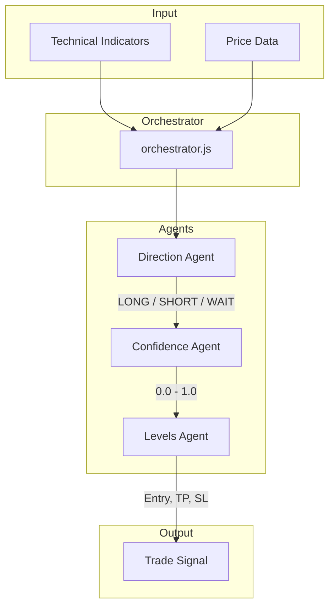

# AI Agents

GPT-4o-mini powered decision system for trade signals.

---

## Architecture



---

## Agent Files

Each pair has its own model directory in `models/`:

```
models/gpt4mini_eurusd/
├── orchestrator.js     # Coordinates all agents
├── direction_agent.js  # LONG / SHORT / WAIT
├── confidence_agent.js # Risk score 0.0 - 1.0
└── levels_agent.js     # Entry, TP, SL prices
```

---

## Direction Agent

**Purpose**: Decide trade direction

**Input**:
- Current price, recent candles
- RSI, MACD, Bollinger Bands
- Support/Resistance levels

**Output**: `LONG` | `SHORT` | `WAIT`

**Prompt Key Points**:
- Trend following in trending markets
- Mean reversion in ranging markets
- WAIT when uncertain

---

## Confidence Agent

**Purpose**: Assess trade quality

**Input**:
- Direction from previous agent
- Same indicator data
- Recent win/loss streak

**Output**: `0.0` to `1.0`

**Thresholds**:
- `< 0.5` → No trade
- `0.5-0.7` → Small position
- `> 0.7` → Full position

---

## Levels Agent

**Purpose**: Set exact prices

**Input**:
- Direction and confidence
- ATR for volatility
- S/R levels

**Output**:
```json
{
  "entry": 1.0850,
  "takeProfit": 1.0880,
  "stopLoss": 1.0830
}
```

**Rules**:
- Minimum 1.5:1 reward/risk
- SL beyond recent swing
- TP at next S/R level

---

## Pair Variants

| Model | Pair | LLM | Notes |
|-------|------|-----|-------|
| `models/gpt4mini_eurusd` | EUR/USD | GPT-4o-mini | Baseline |
| `models/gpt4mini_usdjpy` | USD/JPY | GPT-4o-mini | Structure-aware |
| `models/gpt4mini_gbpusd_iter11` | GBP/USD | GPT-4o-mini | Risk-adjusted, bad pattern detection |
| `models/gpt5_iter5` | EUR/USD | GPT-5.2 | Best performer (78% WR) |

---

## Prompt Iteration

Prompts are iterated in the `base_trainer` branch:
1. Run backtest with current prompt
2. Analyze losing trades
3. Adjust prompt wording
4. Re-test and compare

---

[← Back to Structure](../STRUCTURE.md)
