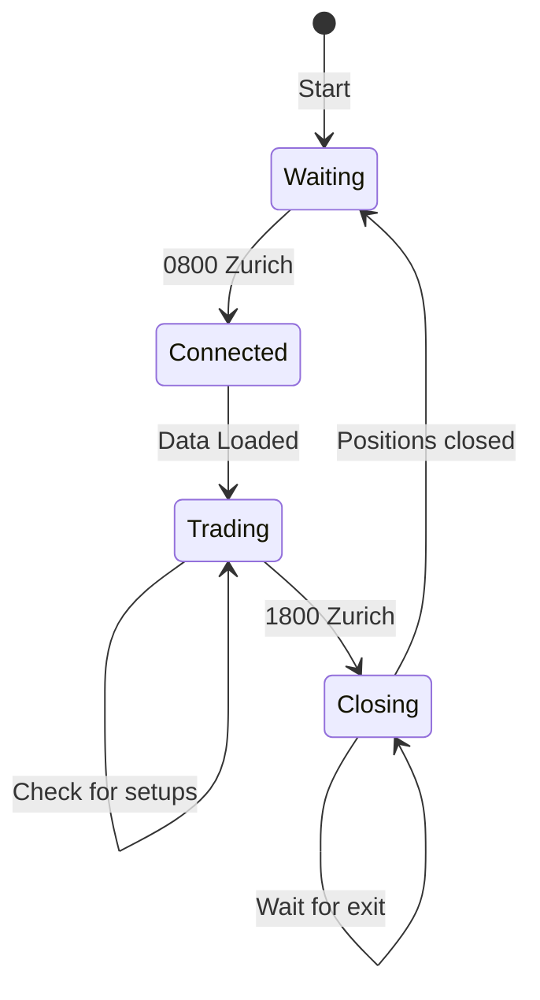

# Live Trader

The main 24/7 trading loop.

---

## Overview



---

## Key File
`src/live_trader.js` (~62KB, main entry point)

---

## Responsibilities

1. **Schedule Management**
   - Detect market hours (08:00-18:00 Zurich)
   - Connect to broker at session start
   - Disconnect at session end

2. **Data Loading**
   - Fetch historical candles on connect
   - Calculate technical indicators
   - Maintain rolling window of data

3. **Trade Loop**
   - Call AI agents every N minutes
   - Execute trades via OANDA executor
   - Log all activity

4. **Position Monitoring**
   - Track open positions
   - Wait for TP/SL before session end
   - Force close if timeout

---

## Configuration

| Setting | Default | Description |
|---------|---------|-------------|
| `TRADING_START` | 08:00 | Session start (Zurich) |
| `TRADING_END` | 18:00 | Stop new trades |
| `CHECK_INTERVAL` | 5 min | How often to check for setups |
| `PAIRS` | EUR/USD, GBP/USD, USD/JPY | Active pairs |

---

## Output Files

- `data/live_trader.log` - All runtime activity
- `data/trade_results.json` - Today's trades summary
- `data/global_trades.json` - Full history

---

## Running

```bash
# Direct
node src/live_trader.js

# Via npm
npm start

# With PM2 (recommended for 24/7)
pm2 start src/live_trader.js --name tradebot
pm2 logs tradebot
```

---

[← Back to Structure](../STRUCTURE.md)
