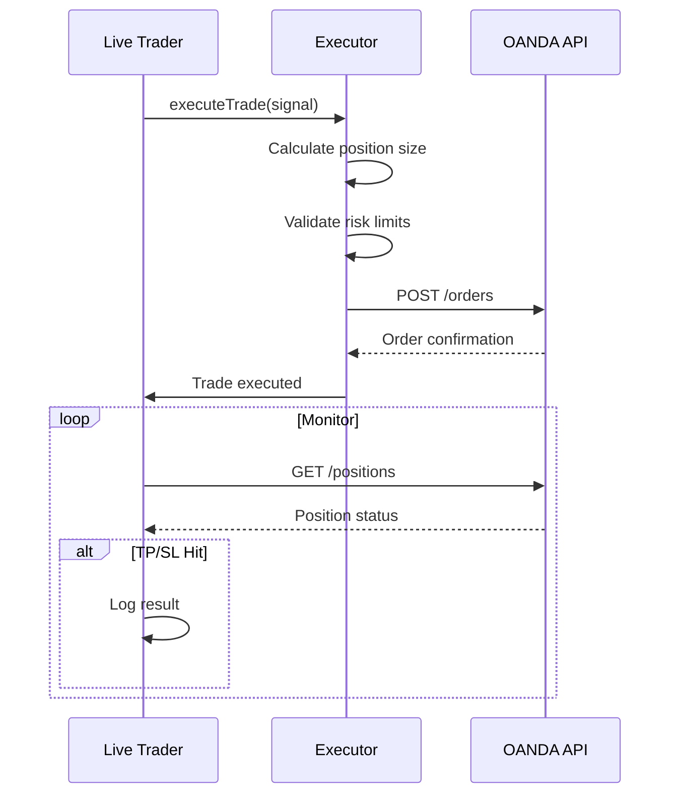
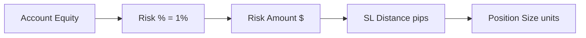

# OANDA Executor

Trade execution and position management via OANDA API.

---

## Overview



---

## Key File
`oanda_executor.js` (~30KB)

---

## Functions

### `executeTrade(signal)`
Places a new order based on AI signal.

```javascript
{
  direction: "LONG",
  entry: 1.0850,
  takeProfit: 1.0880,
  stopLoss: 1.0830,
  confidence: 0.75
}
```

### `getPositions()`
Returns all open positions.

### `closePosition(tradeId)`
Force close a specific trade.

### `getAccountSummary()`
Returns balance, equity, margin used.

---

## Position Sizing



**Formula**:
```
units = (equity × riskPercent) / (slPips × pipValue)
```

---

## Order Types

| Type | Usage |
|------|-------|
| `MARKET` | Immediate execution |
| `LIMIT` | Entry at specific price |
| `STOP` | Breakout entries |

Currently using **LIMIT** orders with small offset from current price.

---

## API Configuration

Environment variables in `.env`:
```
OANDA_API_KEY=your-api-key
OANDA_ACCOUNT_ID=your-account-id
OANDA_API_URL=https://api-fxpractice.oanda.com
```

---

## Error Handling

| Error | Cause | Resolution |
|-------|-------|------------|
| `INSUFFICIENT_MARGIN` | Position too large | Reduce size or wait |
| `MARKET_HALTED` | Weekend/Holiday | Skip, wait for market |
| `RATE_LIMIT` | Too many requests | Backoff 1 second |

---

## Test Scripts

- `test_executor.js` - Basic order test
- `test_oanda_limit.js` - Limit order test
- `test_position_sizes.js` - Size calculation test
- `test_real_trade.js` - Full flow test

---

[← Back to Structure](../STRUCTURE.md)
