# Mermaid Showcase

All diagram types you can use in your docs.

---

## 1. Flowchart (Top-Bottom)

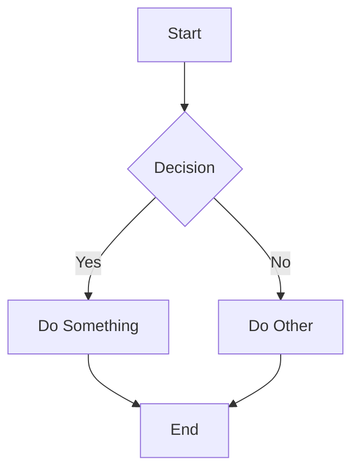

---

## 2. Flowchart (Left-Right)
**Better for horizontal layouts**

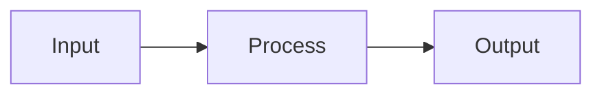

---

## 3. Sequence Diagram
**Great for API calls, interactions**

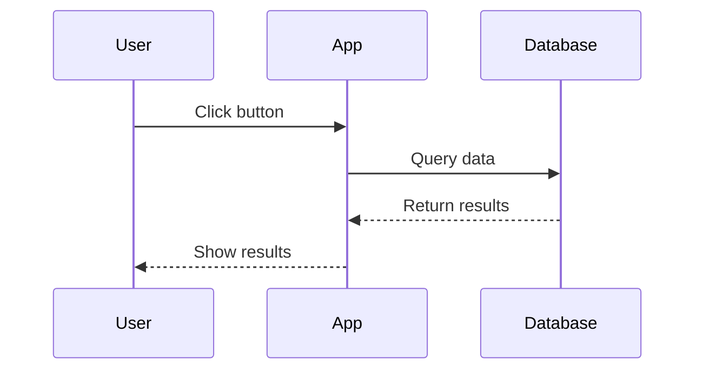

---

## 4. State Diagram
**Perfect for status/lifecycle**

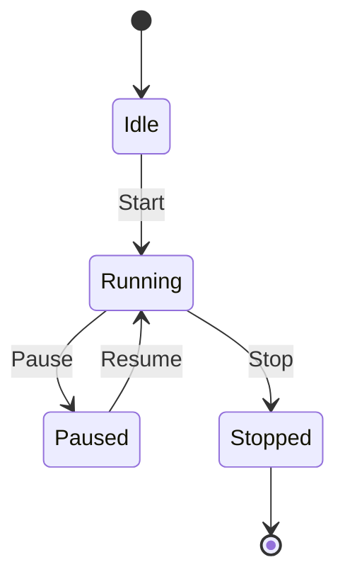

---

## 5. Entity Relationship (ER)
**Database schemas**

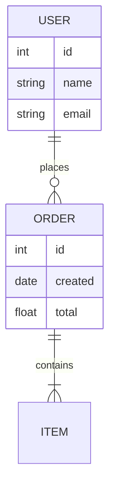

---

## 6. Gantt Chart
**Timelines, schedules**

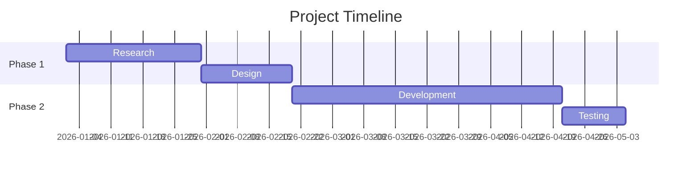

---

## 7. Pie Chart

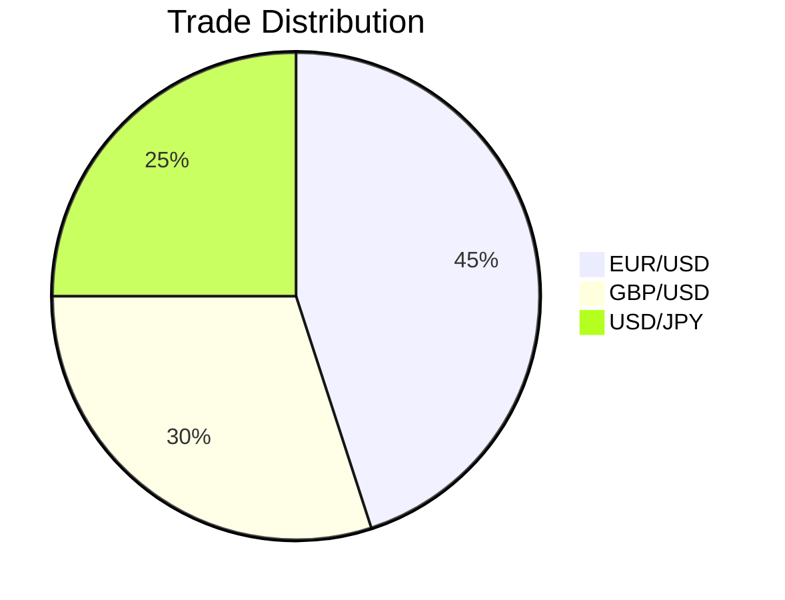

---

## 8. Class Diagram
**Code architecture**

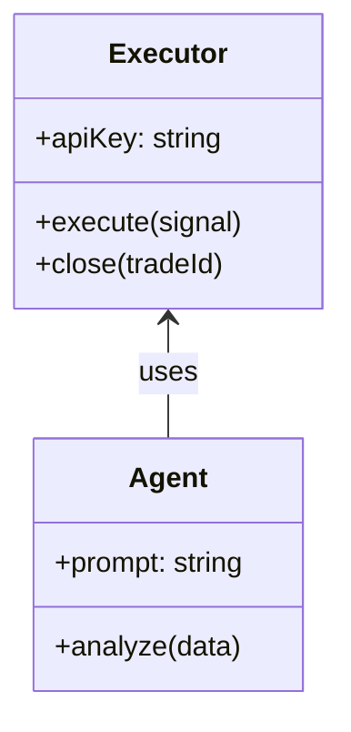

---

## 9. Git Graph
**Branch visualization**

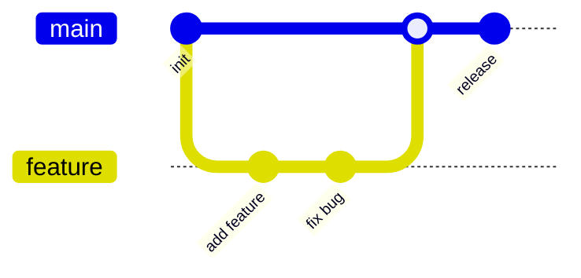

---

## 10. Mind Map

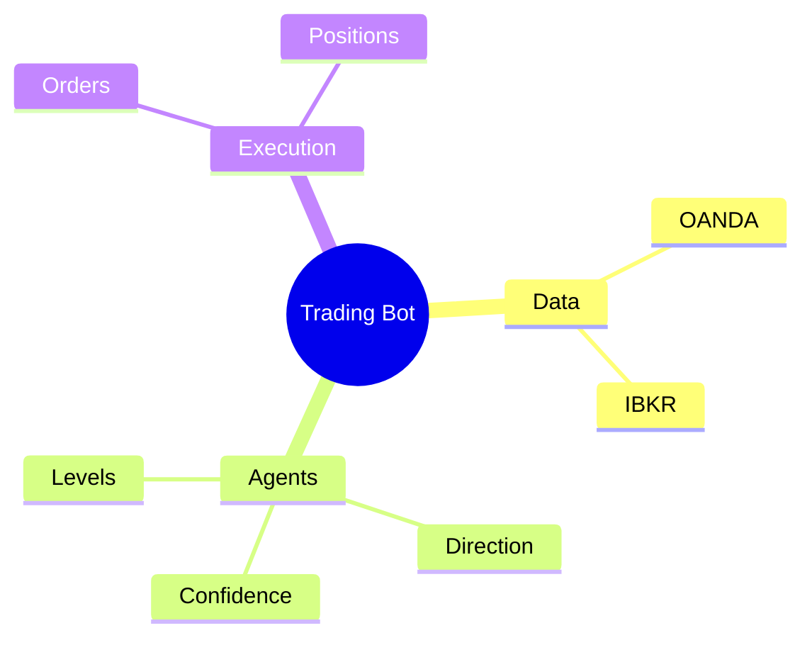

---

## 11. Timeline

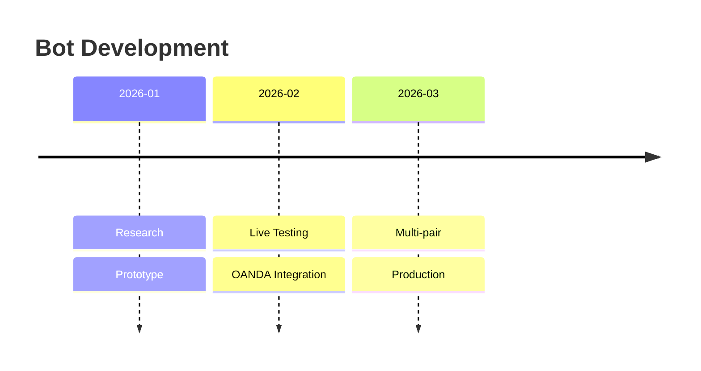

---

## 12. Quadrant Chart

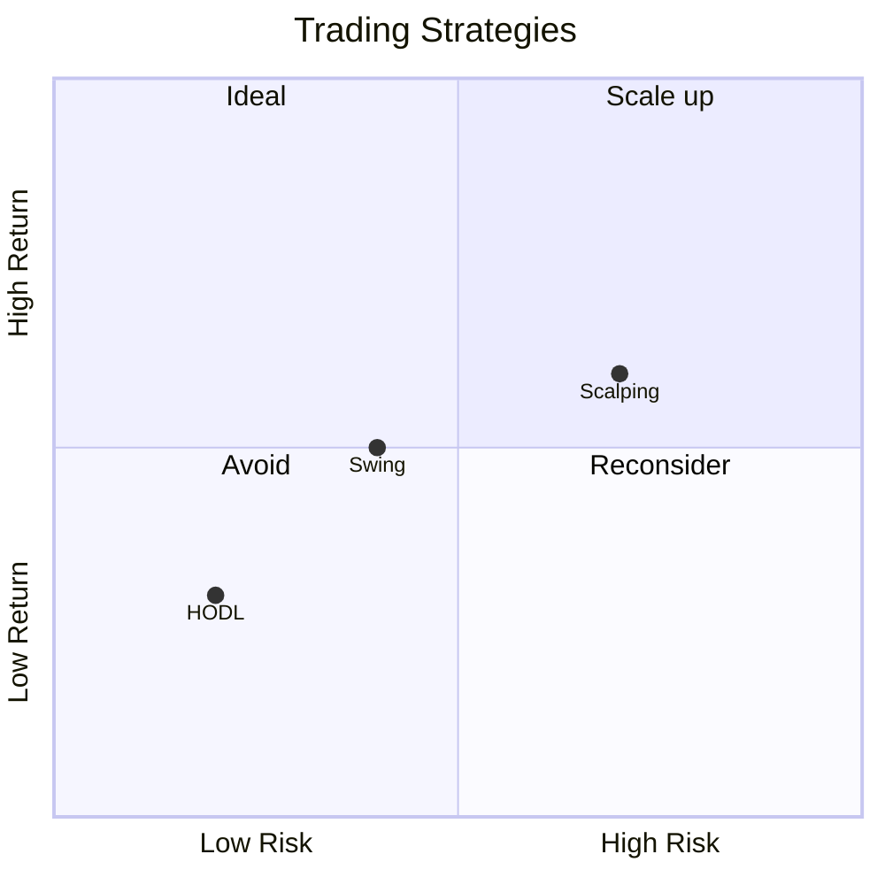

---

## Fixing Horizontal Cropping

Add this to the top of your markdown file to make diagrams wider:

```html
<style>
.mermaid {
    max-width: 100% !important;
}
</style>
```

Or use `flowchart LR` (left-right) instead of `TB` (top-bottom) for narrower, wider diagrams.

---

## More Advanced Tools

| Tool | Best For | Notes |
|------|----------|-------|
| **Mermaid** | Docs, flowcharts | Built into Obsidian |
| **PlantUML** | Complex UML | Needs plugin |
| **D2** | Modern diagrams | CLI tool, very clean |
| **Excalidraw** | Hand-drawn style | Obsidian plugin, interactive |
| **Plotly/Chart.js** | Data plots, graphs | Needs HTML/JS |
| **draw.io** | Everything | Export as PNG/SVG |

### For actual data plots (price charts, PnL):
Mermaid can't do this. Options:
1. **Excalidraw plugin** - Draw charts manually in Obsidian
2. **Export from Python** - Use matplotlib, save as PNG, embed in markdown
3. **Obsidian Charts plugin** - Basic charts from data

---

[← Back to Structure](../STRUCTURE.md)
